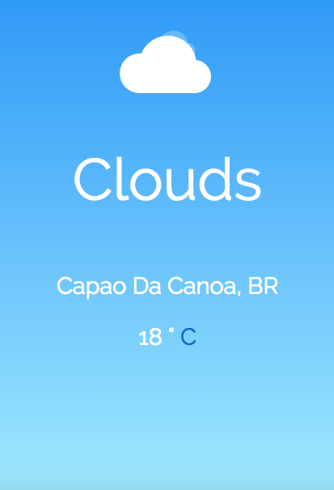

# ShowTheLocalWeather

:sunny: :snowflake: :cloud: :umbrella: :cyclone::zap:

Local weather developed by me as Free Code Camp #2 Intermediate Front End Development Projects.

<ol>
  <li>Objective: Build a CodePen.io app that is functionally similar to this: http://codepen.io/FreeCodeCamp/full/bELRjV.</li>
  <li>Rule #1: Don't look at the example project's code. Figure it out for yourself.</li>
  <li>Rule #2: Fulfill the below user stories. Use whichever libraries or APIs you need. Give it your own personal style.</li>
  <li>User Story: I can see the weather in my current location.</li>
  <li>User Story: I can see a different icon or background image (e.g. snowy mountain, hot desert) depending on the weather.</li>
  <li>User Story: I can push a button to toggle between Fahrenheit and Celsius.</li>
  <li>We recommend using the Open Weather API. This will require creating a free API key. Normally you want to avoid exposing API keys on CodePen, but we haven't been able to find a keyless API for weather.</li>
  <li>Remember to use Read-Search-Ask if you get stuck.</li>
  <li>When you are finished, click the "I've completed this challenge" button and include a link to your CodePen.</li>
  <li>You can get feedback on your project by sharing it with your friends on Facebook.</li>
</ol>

 

